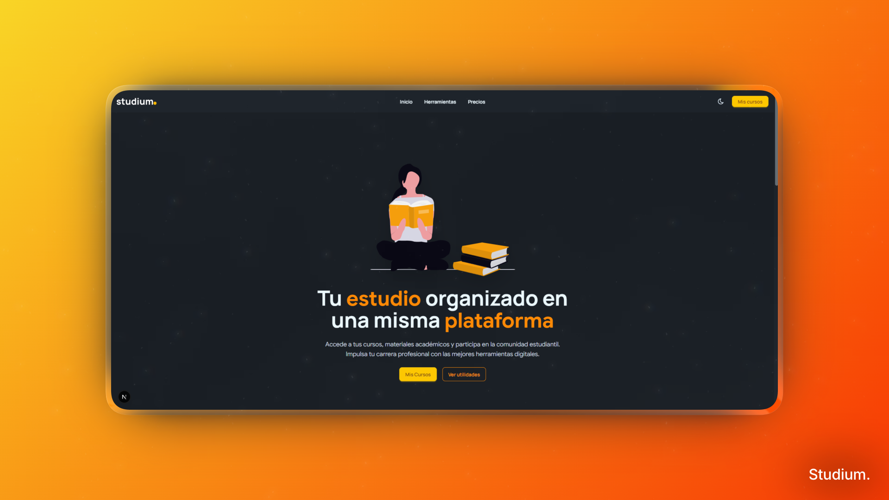
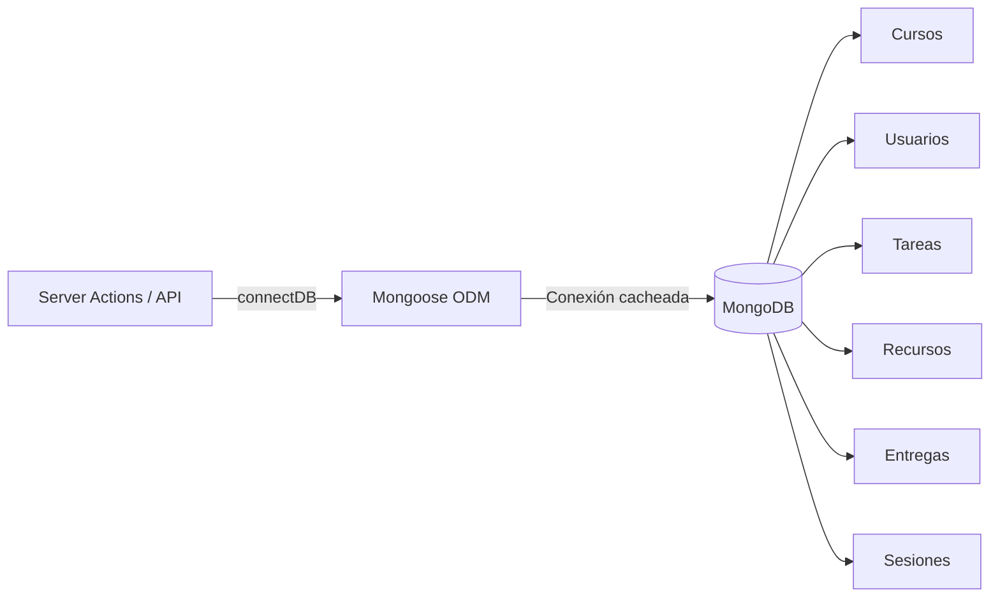
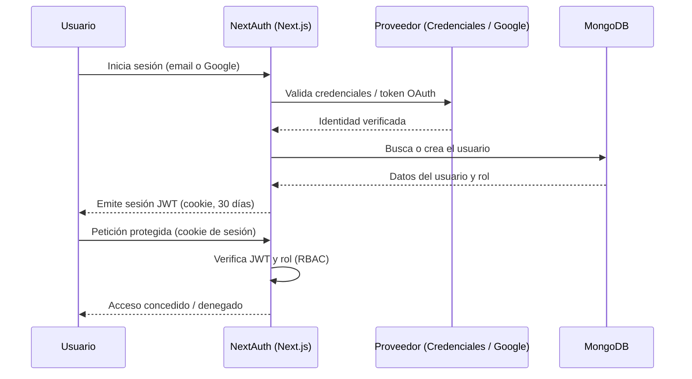
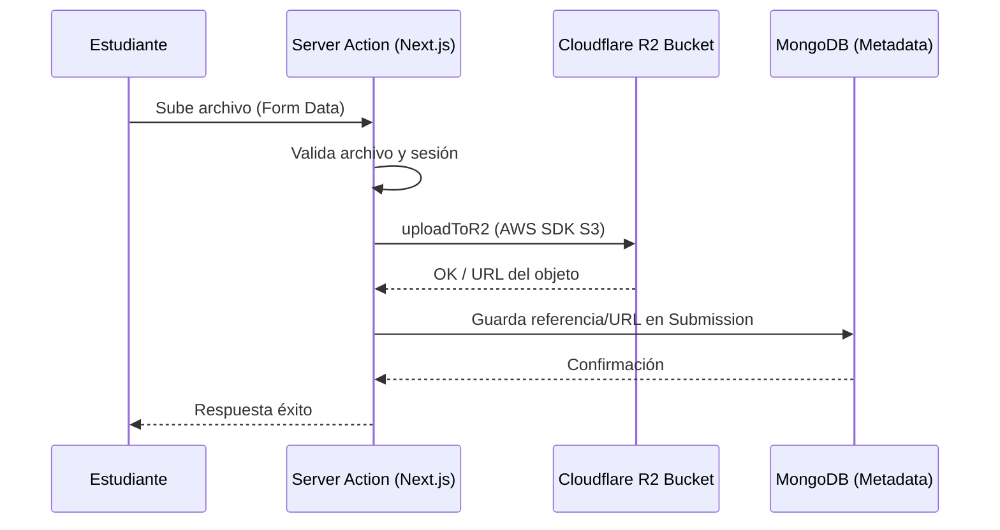
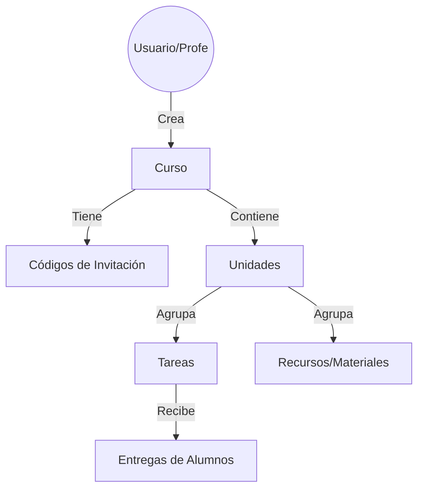
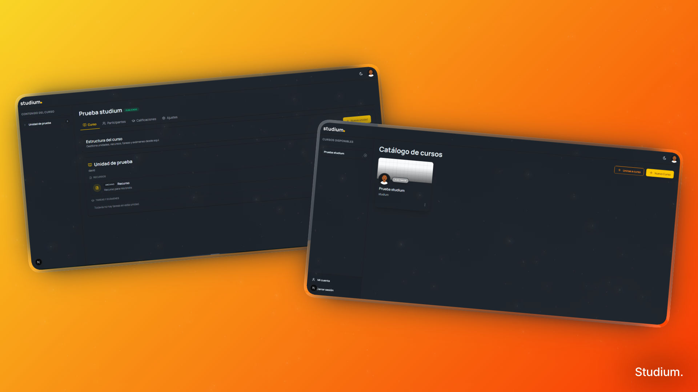

<p align="center">
  
</p>

# Studium.  Plataforma Educativa Moderna

**Studium** es una solución integral para la gestión del aprendizaje (LMS) diseñada para ser modular, escalable y visualmente atractiva. Permite a educadores gestionar cursos, unidades y tareas, mientras proporciona a los estudiantes una experiencia de usuario fluida y reactiva.

---

## Equipo del Proyecto

Este proyecto es desarrollado y mantenido por:

*   *Yusef Laroussi de la Calle*
*   *Eva Cantero Abad* 
*   *Darío Muñoz Rodríguez* 
*   *David López Ferreras* 

---

## Estructura del Proyecto

La organización del código sigue las mejores prácticas de Next.js (App Router) y segmentación de responsabilidades:

```text
studium/
├── public/                     # Recursos estáticos (imágenes, ilustraciones)
└── src/
    ├── app/                    # Rutas, Layouts y Server Actions (App Router)
    │   ├── (landing)/          # Páginas públicas de la landing
    │   ├── account/            # Perfil y cuenta del usuario
    │   ├── actions/            # Server Actions (cursos, tareas, recursos, usuarios...)
    │   ├── admin/              # Panel de administración
    │   ├── api/                # Route Handlers (endpoints API)
    │   ├── auth/               # Login, registro y flujos de autenticación
    │   ├── legal/              # Política de privacidad y términos
    │   ├── mycourses/          # Cursos, unidades, tareas y recursos
    │   ├── globals.css         # Estilos globales y tema (Tailwind + daisyUI)
    │   ├── layout.tsx          # Layout raíz
    │   └── not-found.tsx       # Página 404
    ├── components/             # Componentes UI reutilizables
    │   ├── auth/               # Formularios y vistas de autenticación
    │   ├── courses/            # Vistas y acciones de cursos (FAB, catálogo...)
    │   ├── grades/             # Componentes de calificaciones
    │   ├── modals/             # Modales reutilizables
    │   ├── navbars/            # Navbars y sidebars
    │   ├── participants/       # Tablas y vistas de participantes
    │   ├── profile/            # Perfil de usuario y edición
    │   ├── providers/          # Proveedores de contexto (tema, etc.)
    │   ├── resources/          # Creación y vista de recursos
    │   ├── sections/           # Secciones de página (landing, legal, footer...)
    │   ├── tasks/              # Creación y vista de tareas
    │   └── ui/                 # Primitivas de UI (botones, logo, calendario...)
    ├── config/                 # Configuraciones globales y constantes
    ├── hooks/                  # Hooks de React personalizados
    ├── lib/                    # Utilidades, helpers de API y base de datos
    ├── models/                 # Modelos de datos (Mongoose/MongoDB)
    ├── providers/              # Proveedores de contexto de React
    ├── scripts/                # Scripts de mantenimiento y migraciones
    ├── seed/                   # Datos de prueba para desarrollo
    └── proxy.ts                # Configuración de proxy
```

### Detalle de Carpetas

| Carpeta | Descripción |
| :--- | :--- |
| `src/app` | Lógica de enrutamiento, páginas, layouts y Server Actions (Next.js App Router). |
| `src/components` | Biblioteca de componentes visuales (UI, secciones, formularios) usando Tailwind, daisyUI y Framer Motion. |
| `src/config` | Configuración de fuentes, logger, temas, autenticación y rutas protegidas. |
| `src/hooks` | Hooks de React reutilizables (carga de archivos, listado de cursos, etc.). |
| `src/lib` | Lógica de negocio core: conexión a Mongoose, helpers de autenticación y clientes R2. |
| `src/models` | Definición de esquemas de MongoDB para Cursos, Tareas, Usuarios y Entregas. |
| `src/providers` | Proveedores de contexto globales de React. |
| `src/scripts` | Scripts de mantenimiento y migraciones de datos. |
| `src/seed` | Scripts y datos JSON para inicializar la base de datos local rápidamente. |

---

## Arquitectura de Backend

### Base de Datos con MongoDB

La persistencia se gestiona con **MongoDB** a través de **Mongoose**, que aporta esquemas tipados y validación a nivel de modelo. La conexión se reutiliza entre peticiones (patrón de conexión cacheada) para evitar reconexiones en el entorno serverless de Next.js.



| Colección | Contenido |
| :--- | :--- |
| `users` | Cuentas, perfil, rol (estudiante/profesor/admin) y relaciones con cursos. |
| `courses` | Cursos, unidades, códigos de invitación y propietario. |
| `tasks` | Tareas, fechas, puntuación y asignación de alumnos. |
| `resources` | Materiales del curso (archivo, enlace o texto). |
| `submissions` | Entregas de los alumnos, calificaciones y feedback. |

### Autenticación y Sesiones

La autenticación se gestiona con **NextAuth**, soportando inicio de sesión con **email/contraseña** (hash seguro) y con **Google (OAuth)**. Las sesiones usan **JWT** con una caducidad de **30 días**; los registros expirados se descartan automáticamente.



### Gestión de Archivos con Cloudflare R2

El proyecto utiliza Cloudflare R2 para el almacenamiento de archivos (entregas de tareas, recursos del curso) debido a su compatibilidad con la API de S3 y coste eficiente.



### Jerarquía de Contenido

La estructura de datos está optimizada para la navegación jerárquica de contenidos educativos:



---

## Tecnologías Principales

*   **Frontend:** [Next.js](https://nextjs.org/) (React 19), [Tailwind CSS](https://tailwindcss.com/), [Framer Motion](https://www.framer.com/motion/).
*   **Backend:** [Next.js Server Actions](https://nextjs.org/docs/app/building-your-application/data-fetching/server-actions-and-mutations), [Mongoose](https://mongoosejs.com/).
*   **Base de Datos:** [MongoDB](https://www.mongodb.com/).
*   **Almacenamiento:** [Cloudflare R2](https://www.cloudflare.com/developer-platform/r2/).

---

<p align="center">
  
</p>

*Desarrollado para transformar la educación digital.*

