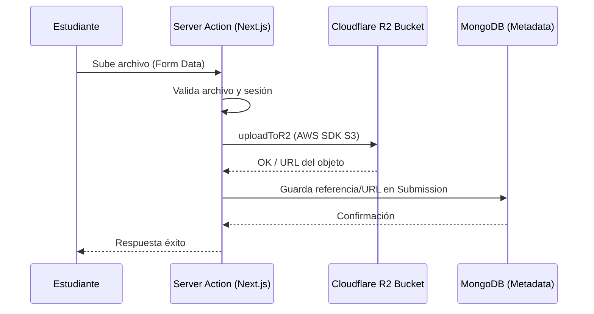
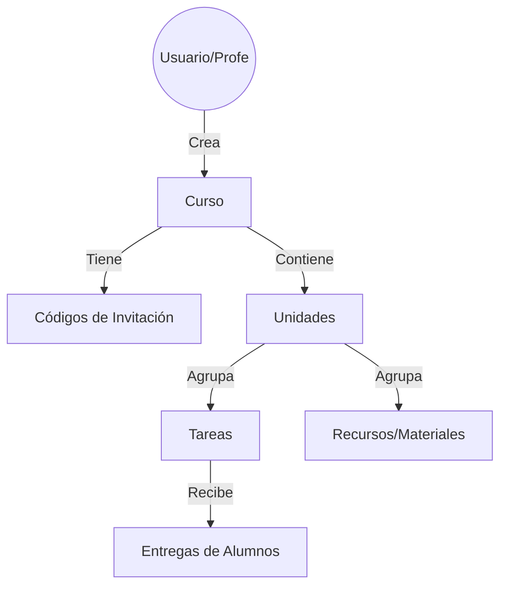

# Studium. | Plataforma Educativa Moderna

**Studium** es una solución integral para la gestión del aprendizaje (LMS) diseñada para ser modular, escalable y visualmente atractiva. Permite a educadores gestionar cursos, unidades y tareas, mientras proporciona a los estudiantes una experiencia de usuario fluida y reactiva.

---

## Equipo del Proyecto

Este proyecto es desarrollado y mantenido por:

*   *Yusef Laroussi de la Calle*
*   *Eva Cantero Abad* 
*   *Darío Muñoz Rodríguez* 
*   *David López Ferreras* 

---

## Estructura del Proyecto

La organización del código sigue las mejores prácticas de Next.js (App Router) y segmentación de responsabilidades:

```text
studium/
├── public/                 # Recursos estáticos (imágenes, ilustraciones)
└── src/
    ├── app/                # Rutas, Layouts y Server Actions
    ├── components/         # Componentes UI reutilizables
    ├── config/             # Configuraciones globales y constantes
    ├── lib/                # Utilidades, ayuda de API y base de datos
    ├── models/             # Modelos de datos (Mongoose/MongoDB)
    ├── providers/          # Proveedores de contexto de React
    ├── scripts/            # Scripts de mantenimiento y migraciones
    └── seed/               # Datos de prueba para desarrollo
```

### Detalle de Carpetas

| Carpeta | Descripción |
| :--- | :--- |
| `src/app` | Contiene la lógica de enrutamiento, páginas y acciones del servidor (Next.js). |
| `src/components` | Biblioteca de componentes visuales (UI, secciones, formularios) usando Tailwind y Framer Motion. |
| `src/lib` | Lógica de negocio core: conexión a Mongoose, helpers de autenticación y clientes R2. |
| `src/models` | Definición de esquemas de MongoDB para Cursos, Tareas, Usuarios y Entregas. |
| `src/config` | Configuración de fuentes, logger, temas y rutas protegidas. |
| `src/seed` | Scripts y datos JSON para inicializar la base de datos local rápidamente. |

---

## Arquitectura de Backend

### Gestión de Archivos con Cloudflare R2

El proyecto utiliza Cloudflare R2 para el almacenamiento de archivos (entregas de tareas, recursos del curso) debido a su compatibilidad con la API de S3 y coste eficiente.



### Jerarquía de Contenido

La estructura de datos está optimizada para la navegación jerárquica de contenidos educativos:



---

## Tecnologías Principales

*   **Frontend:** [Next.js](https://nextjs.org/) (React 19), [Tailwind CSS](https://tailwindcss.com/), [Framer Motion](https://www.framer.com/motion/).
*   **Backend:** [Next.js Server Actions](https://nextjs.org/docs/app/building-your-application/data-fetching/server-actions-and-mutations), [Mongoose](https://mongoosejs.com/).
*   **Base de Datos:** [MongoDB](https://www.mongodb.com/).
*   **Almacenamiento:** [Cloudflare R2](https://www.cloudflare.com/developer-platform/r2/).

---

*Desarrollado para transformar la educación digital.*

